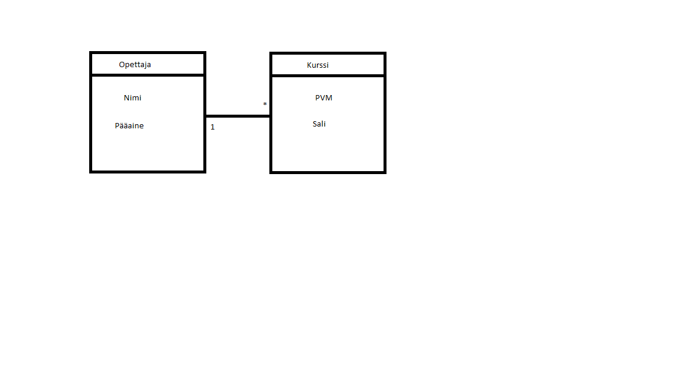

# Tietokannat

1. Minun nimellä löytyy Olaffeja ja muita ruotsalaisia
Matti nimellä löytyy paljon Mathiasta
Maija nimellä löytyy 2 nimisiä nimejä paljon

2. Nii kyllähän sitä tulee tietoja aina laitettuu kaikkialle vaikkei tietäiskää kenelle ja minne ne päätyy

3. 

4. SELECT * 
FROM Kurssisuoritus

5. SELECT kurssi 
FROM Kurssisuoritus

6. SELECT DISTINCT kurssi 
FROM Kurssisuoritus

7. SELECT * 
FROM Opiskelija 
WHERE nimi = 'Anna'

8. SELECT * 
FROM Kurssisuoritus 
WHERE Kurssisuoritus.opiskelija = 'Pihla'

9. SELECT * 
FROM Opiskelija 
WHERE pääaine NOT LIKE 'tiede'

10. SELECT Kurssi.nimi, Kurssisuoritus.päivämäärä, Kurssisuoritus.arvosana 
FROM Kurssisuoritus, Kurssi 
WHERE Kurssi.kurssitunnus=Kurssisuoritus.kurssi

11. SELECT Opiskelija.nimi, Kurssisuoritus.päivämäärä, Kurssisuoritus.arvosana 
FROM Kurssisuoritus, Kurssi, Opiskelija 
WHERE Kurssi.kurssitunnus=Kurssisuoritus.kurssi

12. SELECT Kurssi.nimi AS kurssi, Kurssitehtävä.tehtävä AS tehtävä 
FROM Kurssi, Kurssitehtävä 
WHERE Kurssi.kurssitunnus = Kurssitehtävä.Kurssi

13. SELECT Kurssi.nimi AS kurssi, Tehtävä.nimi AS tehtävä
FROM Kurssi, Tehtävä, Kurssitehtävä, Opiskelija, Tehtäväsuoritus
WHERE Opiskelija.nimi = 'Anna'
AND Kurssi.kurssitunnus = Kurssitehtävä.kurssi
AND Tehtävä.tunnus = Kurssitehtävä.tehtävä
AND Opiskelija.opiskelijanumero = Tehtäväsuoritus.opiskelija
AND Kurssitehtävä.tunnus = Tehtäväsuoritus.tehtävä

14. 4 ja 5 rivi on suoritettuja kursseja

15. SELECT nimi FROM Kurssi K
WHERE K.kurssitunnus
NOT IN (SELECT tunnus FROM Kurssitehtävä)

16. SELECT kurssi AS kurssikoodi, COUNT(*) AS lukumäärä 
FROM Kurssisuoritus GROUP BY kurssi

17. SELECT nimi AS kurssi, COUNT(kurssi) AS lukumäärä
FROM Kurssi, Kurssisuoritus
WHERE Kurssisuoritus.kurssi = Kurssi.kurssitunnus GROUP BY kurssi

18.SELECT nimi AS kurssi, COUNT(kurssi) AS lukumäärä
FROM Kurssi LEFT JOIN Kurssisuoritus
ON kurssitunnus = kurssi GROUP BY nimi

19. CREATE TABLE Kurssi (kurssitunnus, nimi, kuvaus)

20. INSERT INTO Kurssi (nimi, kurssitunnus, kuvaus)
VALUES  ('SQL-kielen perusteet', '12345',  'Hei maailma')

21. CREATE TABLE Kurssi3 (kurssitunnus, nimi, kuvaus) ///
PRAGMA TABLE_INFO(Kurssi3)

22. CREATE TABLE Kurssi
(
kurssitunnus integer,
nimi varchart(200),
kuvaus varchart(250)
)

23. Koska tietokantatauluun on määritelty avain, joka on uniikki, ei taulun sarakkeessa opiskelijanumero voi olla kahta samaa arvoa.

24. CREATE TABLE Kurssi
(
kurssitunnus integer PRIMARY KEY,
nimi varchart(200),
kuvaus varchart(250)
)

25. CREATE TABLE Tehtävä
(
tunnus integer PRIMARY KEY,
nimi varchart(200) NOT NULL
);
CREATE TABLE Kurssitehtävä
(
tunnus integer PRIMARY KEY,
tehtävä integer,
kurssi integer,
FOREIGN KEY(tehtävä)REFERENCES Tehtävä(tunnus),
FOREIGN KEY(kurssi)REFERENCES Kurssi(kurssitunnus)
)

26. INSERT INTO Tehtävä(nimi) VALUES('teht1');
INSERT INTO Tehtävä(nimi) VALUES('teht2');
INSERT INTO Tehtävä(nimi) VALUES('teht3');

INSERT INTO Kurssitehtävä (kurssi, tehtävä)
VALUES ((SELECT kurssitunnus FROM Kurssi WHERE nimi = 'Ohpe'),(SELECT tunnus FROM Tehtävä WHERE nimi  = 'teht1'));

INSERT INTO Kurssitehtävä (kurssi, tehtävä)
VALUES ((SELECT kurssitunnus FROM Kurssi WHERE nimi = 'Ohpe'),(SELECT tunnus FROM Tehtävä WHERE nimi  = 'teht2'));

INSERT INTO Kurssitehtävä (kurssi, tehtävä)
VALUES ((SELECT kurssitunnus FROM Kurssi WHERE nimi = 'Tikape'),(SELECT tunnus FROM Tehtävä WHERE nimi  = 'teht3'));

27. ALTER TABLE -käskyä käytetään lisäämään, poistamaan tai muokkaamaan olemassa olevan taulukon sarakkeita.
ALTER TABLE -käskyä käytetään myös lisäämään ja pudottamaan erilaisia ​​rajoituksia olemassa olevaan taulukkoon.
